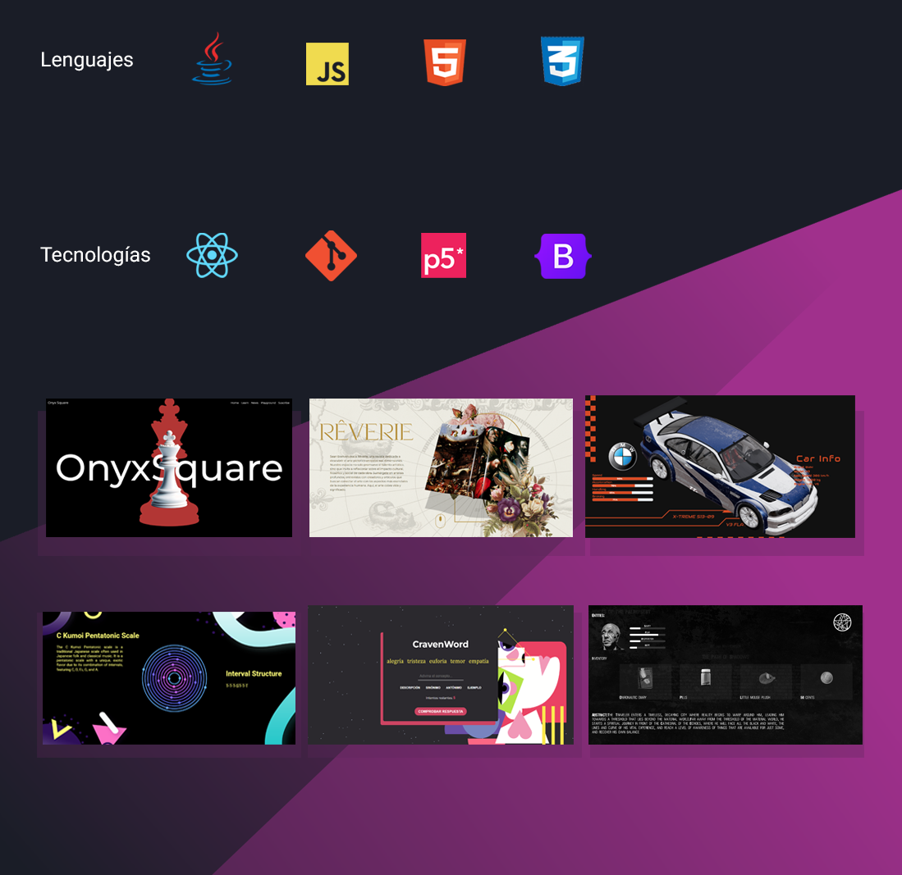

# Creative Coding  

Full Stack Developer con mentalidad analítica y creativa. Experiencia en backend (Java, Spring Boot, Node.js) y frontend (React, WebGL, Three.js). Me interesan los sistemas distribuidos, la visualización 3D y los entornos inmersivos. Siempre buscando expandir los límites entre arte y código.

Portfolio web: https://symphonious-belekoy-ff5769.netlify.app

